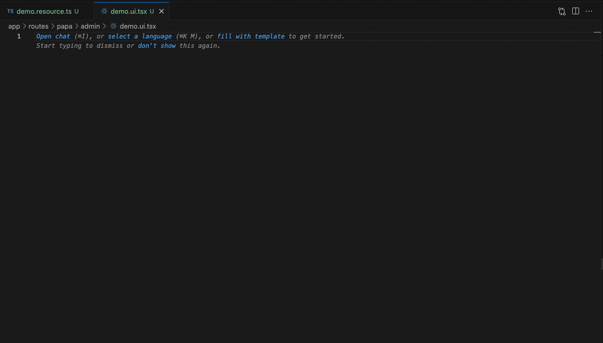

# React Router v7 Framework Snippet README

This simple snippet make it easy to develope with React Router v7 / Remix v3. Including useful `action` / `loader` on both client or server side, and snippets for resource / ui routes.

## Features

---

# Snippets

|    Prefix | Description                                                               |
| --------: | ------------------------------------------------------------------------- |
|   `rrrr→` | **R**eact **R**outer **r**esource **r**oute with action and loader        |
|   `rrur→` | **R**eact **R**outer **U**I **r**oute with loader, action, and component  |
|    `rrl→` | **R**eact **R**outer **l**oader function                                  |
|    `rra→` | **R**eact **R**outer **a**ction function                                  |
|   `rrcl→` | **R**eact **R**outer **c**lient **l**oader function                       |
|   `rrca→` | **R**eact **R**outer **c**lient **a**ction function                       |
| `rrcomp→` | **R**eact **R**outer default **comp**onent with loaderData and actionData |
