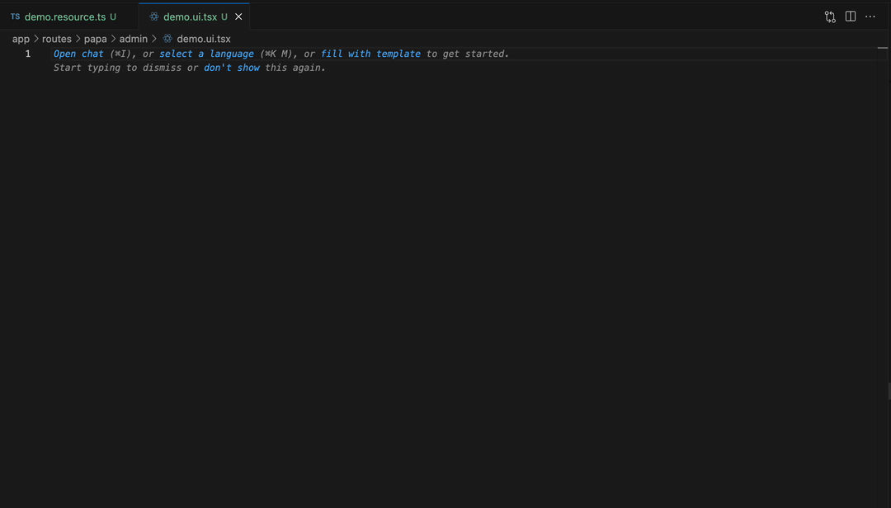

# React Router v7 Framework Snippets

This comprehensive snippet collection includes all [Route Modules](https://reactrouter.com/start/framework/route-module) in React Router v7.

## Features



---

# Snippets

|      Prefix           | Description                                          |
| ---------------------:| ---------------------------------------------------- |
| `rrrr→`               | Resource route (route without default component)     |
| `rrur→`               | UI route (route export default component)            |         
| `rrcomp→`             | Route module default component                       |
| `rrcompprops→`        | Component with `Route.ComponentProps`                |
| `rrmw→`               | Route `middleware` (server)                          |
| `rrcmw→`              | Route `clientMiddleware` (browser)                   |
| `rrl→`                | Route `loader`                                       |
| `rra→`                | Route `action`                                       |
| `rrcl→`               | Route `clientLoader`                                 |
| `rrca→`               | Route `clientAction`                                 |
| `rreb→`               | Route `ErrorBoundary` component                      |
| `rrhf→`               | Route `HydrateFallback` component                    |
| `rrheaders→`          | Route `headers` function                             |
| `rrhandle→`           | Route `handle` export                                |
| `rrlinks→`            | Route `links` function                               |
| `rrmetatag→`          | Recommended built-in `<meta>`/`<title>` usage        |
| `rrmeta→`             | Route `meta` function export                         |
| `rrshouldrevalidate→` | Route `shouldRevalidate` function                    |
| `rrfull→`             | Full route module template                           |

## What's New in v2.0.0

-  **All Modules Included** - Covers all modules in [https://reactrouter.com/start/framework/route-module](https://reactrouter.com/start/framework/route-module)

## Usage Examples

### Resource Route (`rrrr`)
```typescript
import type { Route } from "./+types/route";

export async function loader() {
    return { message: "Hello, world!" };
}

export async function action({ request }: Route.ActionArgs) {
    const data = await request.formData();
    // TODO: POST/PUT/DELETE/PATCH data
    return { ok: true };
}
```

### UI Route (`rrur`)
```typescript
import type { Route } from "./+types/route";
import { Form } from "react-router";

export async function action({ request }: Route.ActionArgs) {
    const data = await request.formData();
    // TODO: POST/PUT/DELETE/PATCH data
    return { ok: true };
}

export async function loader() {
    // TODO: GET data
    const items = ['Item 1', 'Item 2', 'Item 3'];
    return { items };
}

export default function Component({ loaderData }: Route.ComponentProps) {
    return (
        <div>
            {loaderData.items.map((item) => (
                <p key={item}>{item}</p>
            ))}
            <Form method="post" navigate={false} action="/list">
                <input type="text" name="title" />
                <button type="submit">Create Todo</button>
            </Form>
        </div>
    );
}
```

### Middleware (`rrmw`)
```typescript
import type { Route } from "./+types/route";

const loggingMiddleware: Route.MiddlewareFunction = async ({ request, context }, next) => {
    console.log(`${new Date().toISOString()} ${request.method} ${request.url}`);
    const start = performance.now();
    const response = await next();
    const duration = performance.now() - start;
    console.log(`${new Date().toISOString()} Response ${response.status} (${duration}ms)`);
    return response;
}

export const middleware = [loggingMiddleware];
```

## Requirements

- React Router v7 or Remix v3
- TypeScript
- VS Code

## Installation

### Option 1: VS Code Marketplace
Search for "React Router v7 Snippets" in the VS Code Extensions marketplace.

### Option 2: Manual Installation
1. Copy the snippets in [./snippets/snippets.code-snippets](./snippets/snippets.code-snippets)
2. VS Code Command Palette (Ctrl+Shift+P (Windows/Linux) or Cmd+Shift+P (macOS)) → Configure User Snippets
3. Search for "Snippets": Preferences: Configure Snippets
4. Paste the snippets and save

## Contributing

Found a bug or want to add more snippets? Feel free to open an issue or submit a pull request!

## License

MIT

---